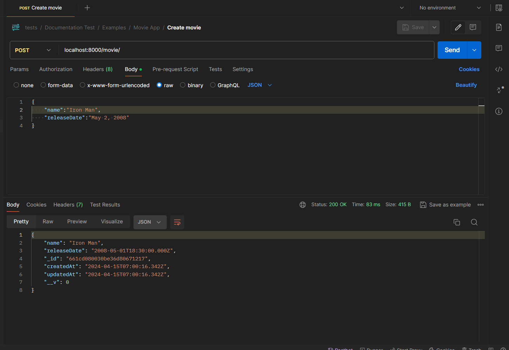
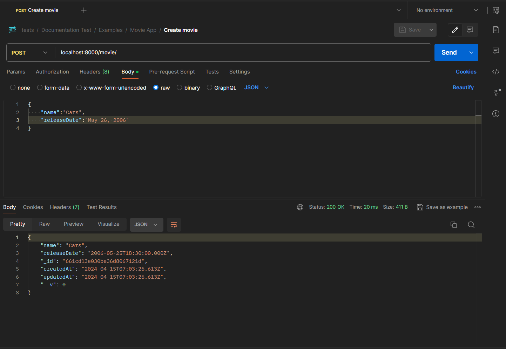
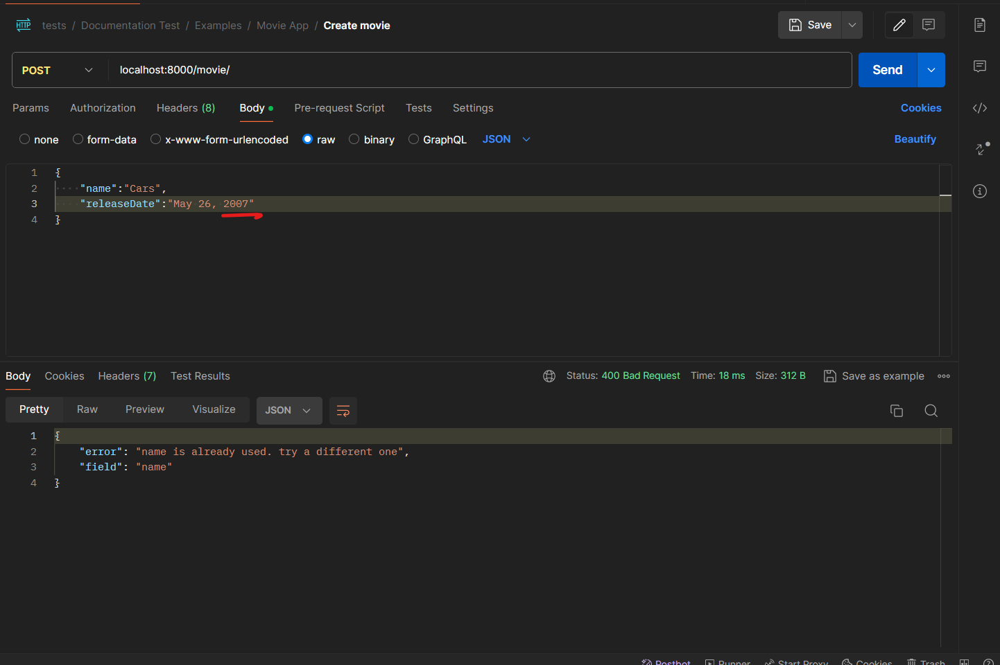
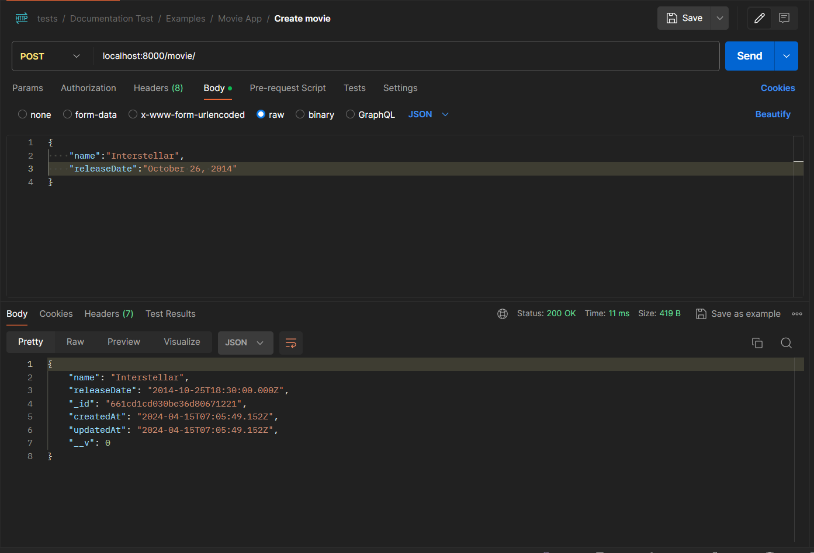
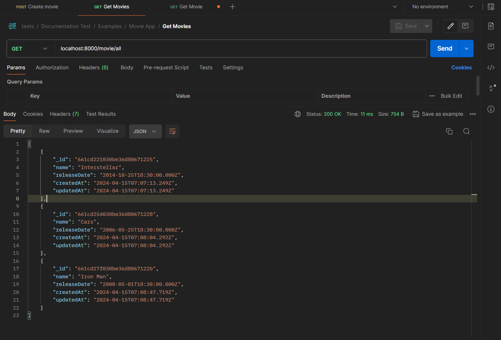
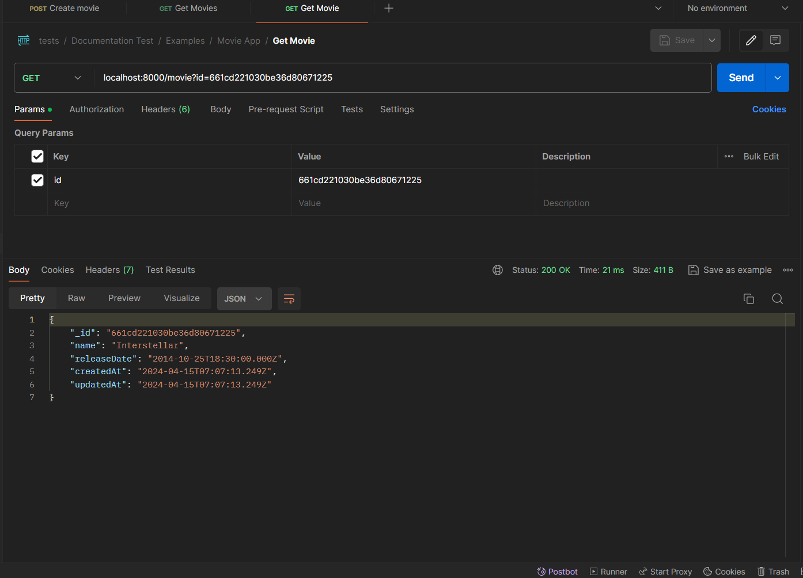
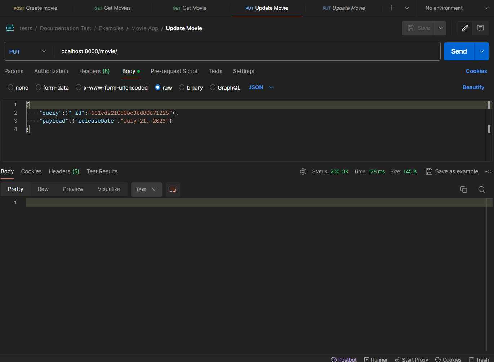
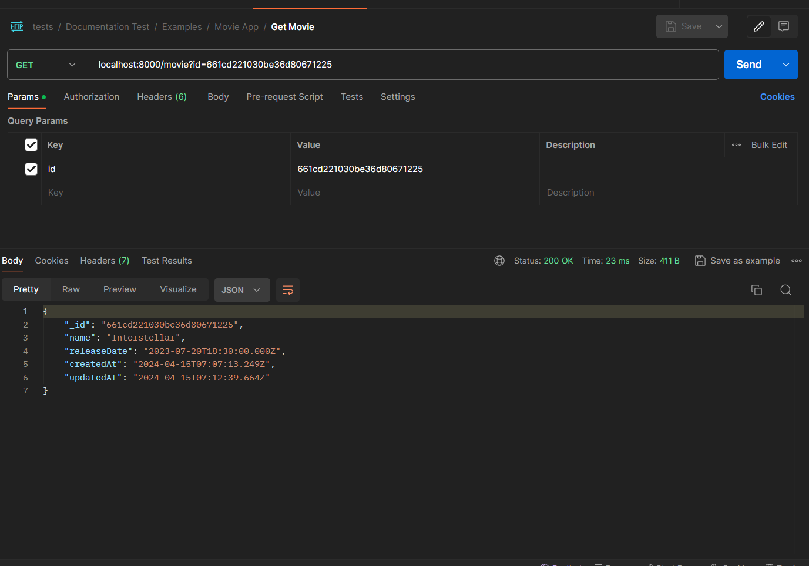
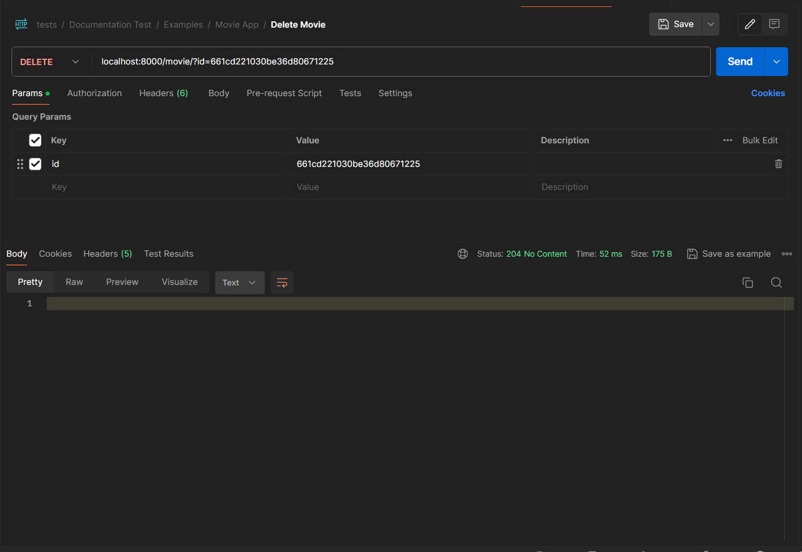
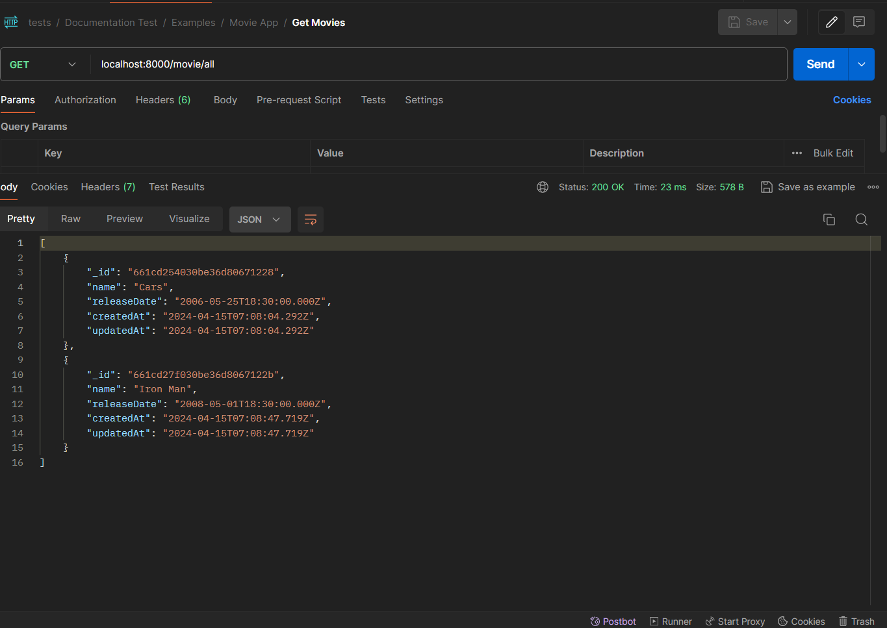

# Movie Saving App 
 In this example , We are going to create a program to save movies,get movies,update movies and delete movies.We won't explore the most advance things in this section but this will give you bit of understanding about how the library works.So let's get to work.👍👍

 ## Create a server
Creating the server is the first step we are gonna take right now.If you don't know how `express` framework works , well you have to learn it before continuing.Before `fast-express-backend` is a helper library for express.Not a framework like `express`.So following links might help you.

1. [A Beginner Guide](https://medium.com/@skhans/building-a-restful-api-with-express-js-a-beginners-guide-dcb1a1e3520d "a beginner guide in the medium") - a beginner guide about rest api in express

2. [A Beginner Guide - Youtube Video](https://www.youtube.com/watch?v=o3ka5fYysBM "youtube video about express") - highly recommend if you don't know anything about `express`

So now let's get to work.First of all we are gonna import the express framework and create a app instance of it.Call this file as `index.js`

```javascript
const express = require("express")
const app = express()
```

we just import express and then execute the high order function of it.That's it.Next step is to be able to send data between user and client via json.(We are gonna send and receive data in `json` most of the time).So let's enable it.(Notice this is a `middleware` in express.Don't worry if you don't know what are middlewares we will tell later.)

```javascript
const express = require("express")
const app = express()
app.use(express.json())
```

And that's it.Now we have the ability to send and and receive data in json.let's make sure when we run the file we are gonna turn on the server

```javascript
const express = require("express")
const {runApp} = require("fast-express-backend")

const app = express()
app.use(express.json())

runApp(app)
```

if you run this,you should get a message saying that `app is running on port 8000` or something like that.Just in few lines of codes we have created the server.But at the moment it doesn't matter cuz we can't get any use of it 😂😂😂.So let's begin to adding more values to our server.Next thing we want to do is to be able to communicate between database and our server.At the moment we are only limited mongodb so let's see how to connect it with the help `fast-express-backend`.
If you don't have any idea about the url in database connection please refer the following [Setting up Database Connection](https://www.youtube.com/watch?v=sx2zTNiaBuM "youtube video about mongodb connection").If you know how to,then let's start the work.


```javascript
const express = require("express")
const {runApp,connectMongoose} = require("fast-express-backend")

const app = express()
app.use(express.json())

runApp(app,8000,null,connectMongoose("mongodb://localhost:27017/tests"))
```

Well we just changed only two lines.let's examine them a little bit.
1. We import a another function from `fast-express-backend` it's called `connectMongoose`.This function will let us connect to mongodb.

`const {runApp,connectMongoose} = require("fast-express-backend")`

2. We make some changes in the `runApp` function.Well as previous we first provide the `app` instance.Then we give it a port number.Third argument is set to be null,third argument should a be non argument function or null.It will return as soon as the server is up.For now we don't need it.Last argument is a also a function.It runs before the server is up.So it's better to connect mongodb before the server is up😊😊😊.

## Creating models
Now we are gonna create a new file called `models.js` you can call it anything.But when we import things it's might be a little bit easier if we have same names.But no problems you are free to call it anything you want 👍👍👍.In the `models.js` first we are gonna import three things.

```javascript
const {DataClass} = require("fast-express-backend")
const {validators} = require("fast-express-backend/dataclasses")
const {createMongoDBField} = require("fast-express-backend/utils")
```

First import `DataClass` will be used to define models(Schemas) in the database and validators will be used to validate data and last but not least we will use `createMongoDBField` to complete things with less typing.

```javascript
const {DataClass} = require("fast-express-backend")
const {validators} = require("fast-express-backend/dataclasses")
const {createMongoDBField} = require("fast-express-backend/utils")

class Movie extends DataClass{
    getName() {return "movies"}
    name = createMongoDBField(String,true,
        [
        validators.is_required("Movie name is required"),
        validators.maxLength(20,"Movie name cannot be longer than 20 characters")
        ]
    )
    releaseDate = createMongoDBField(Date,false,[validators.is_required("Movie release date is required")])
}

module.exports = {Movie}
```

So we have created a class which extends from `DataClass`.Well our model gonna have two fields.That are `name` and `releaseDate`.There are few things going here , let's break things.
1. `getName()` - this function must be override by the sub class.It must returns a unique name.That means there can be one data class which returns "movies" when we run the `getName()`
2. `name` - well this is a attribute class gonna have.name is a object in the class.When we pass the data it will change
```javascript
name = createMongoDBField(String,true,
        [
        validators.is_required("Movie name is required"),
        validators.maxLength(20,"Movie name cannot be longer than 20 characters")
        ]
    )
```

`createMongoDBField` is a just function returns an object.The above `name` object can be written like this too.
```javascript
name = {
    type:String,
    unique:true,
    validators:[ validators.is_required("Movie name is required"),  validators.maxLength(20,"Movie name cannot be longer than 20 characters")]
}
```
We makes the `name` to be `unique` so we can't have two movies with the name.We gonna have to change at least one character.Then we see there are validators.With validators we make sure that name must be given and it should not exceed 20 characters.

3. Just like that we define the release date.Now we have a dataclass ready to be used.Finally we exports the `Movie` data class so we can use it in another files.
`module.exports = {Movie}`

## Register the model to server
Next thing we have left to do is to create endpoints to create movies and get movies and etc.For handling movies we gonna create a specific route for it.Then let's get back to the `index.js` file.
For creating routers , we are gonna import another function from the `fast-express-backend`(You can do it with express too.Because this is the same router in express)

```javascript
const express = require("express")
const {runApp,connectMongoose,createRouter} = require("fast-express-backend")

const app = express()
app.use(express.json())

const movieRouter = createRouter()

runApp(app,8000,null,connectMongoose("mongodb://localhost:27017/tests"))
```

So we make two changes in the file.
1. Import the `createRouter` function.
2. create a new router called `movieRouter` to handle movie endpoints.

Next we are gonna import the `Movie` DataClass in order to save get and delete movies.

```javascript
const express = require("express")
const {runApp,connectMongoose,createRouter} = require("fast-express-backend")
const {Movie} = require("./models.js")

const app = express()
app.use(express.json())

const movieRouter = createRouter()

runApp(app,8000,null,connectMongoose("mongodb://localhost:27017/tests"))
```

`fast-express-backend` is dynamic enough to define basic endpoints.That means we are capable of defining `get`,`post`,`delete`,`update` views for general use with the help of `applyBasicCurds` function.

```javascript
const express = require("express")
const {applyBasicCrud,runApp,connectMongoose,createRouter} = require("fast-express-backend")
const {Movie} = require("./models.js")

const app = express()
app.use(express.json())

const movieRouter = createRouter()

runApp(app,8000,null,connectMongoose("mongodb://localhost:27017/tests"))
```

Then let's finish things.So we are gonna write two lines and that's gonna be it.

```javascript
const express = require("express")
const {applyBasicCrud,runApp,connectMongoose,createRouter} = require("fast-express-backend")
const {Movie} = require("./models.js")

const app = express()
app.use(express.json())

const movieRouter = createRouter()

applyBasicCrud(movieRouter,Movie)
app.use("/movie",movieRouter)

runApp(app,8000,null,connectMongoose("mongodb://localhost:27017/tests"))
```
That's it.We first run `applyBasicCrud`  function. It takes the router first and then the data class.
```javascript
applyBasicCrud(movieRouter,Movie)
```

Then we tell the express where to use these endpoints.
```javascript
app.use("/movie",movieRouter)
```

So at the moment we have few endpoints.
1. get - localhost:8000/movie
2. post - localhost:8000/movie
3. getAll - localhost:8000/movie/all
4. put - localhost:8000/movie
5. delete - localhost:8000/movie


We are going to use `postman` for testing.And first of all let's run the server.
Your directory structure should look like this.
```
node_modules
index.js
models.js
```

Then run `node index.js` and let's start testing.

## Testing 

### Creating movies
First of all we are going to create few movies.Only three for now.


Then we ran the second request twice and got to different responses.
.
Then we change the date and re ran again.But this time we got an error saying name must be unique.That's because we set the name to be unique.So we can't have two movies with the same name(for this application)




### Getting movies
First let's see how to get all the movies.You just make a get request to /movie/all


To get one movie we need the id of the movie.Grab a one from get all response.And we make a get request /movie endpoint with id as a query parameter.



### Updating a movie
In order to update we make a put request to /movie.Json body should have two things.
query and payload.Most of the time query object gonna look like this.
```javascript
query:{"_id":"some random id"}
```
In the payload we give what we need to change as key value pairs.


Then get that movie with get request with it's id.


### Deleting movie
To delete a movie we make a  delete request to /movie.As it's in get we need the id as a query parameter.


So let's make a getAll request to see whether it's deleted or not.


That's it.That's the basic tests we run for now.